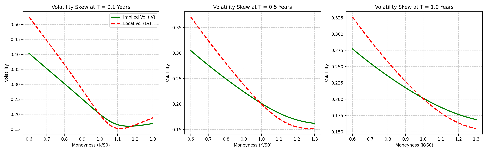
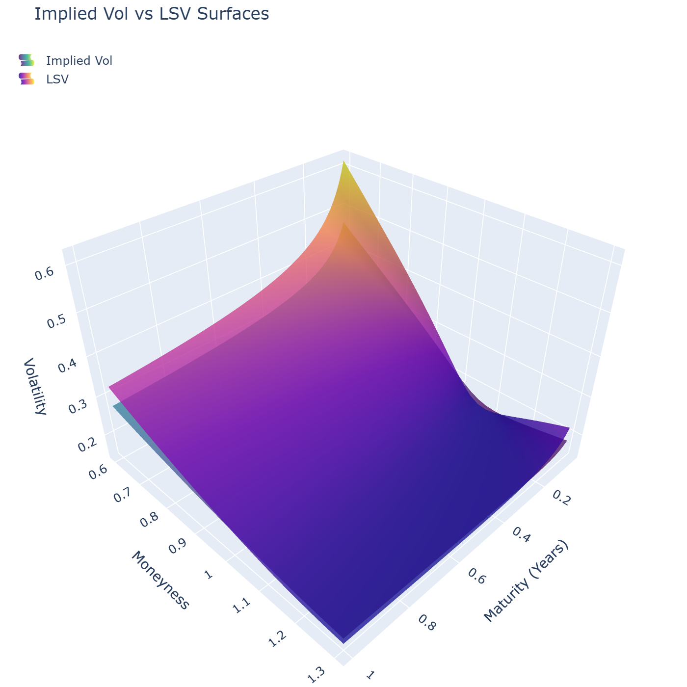

# Local Stochastic Volatility (LSV) Calibration 

This repository implements a complete calibration engine for the Local Stochastic Volatility (LSV) model.

In equity derivatives trading, pure local volatility models tend to flatten the forward smile, often underpricing path-dependent options. Conversely, pure stochastic volatility models struggle to perfectly calibrate to the short-term skew. The LSV model combines the strengths of both: the stochastic dynamic manages the forward smile, while a non-parametric leverage function ensures exact calibration to the market's vanilla surface.

### 1. Target Market Generation (SSVI & Dupire)
To avoid static arbitrage in the target implied volatility surface, we generate a synthetic market using the Surface Stochastic Volatility Inspired (SSVI) parameterization. The total variance $w(k, t) = \sigma_{IV}^2(k, t)$ , where $k = \log(K/F)$, is defined as:

$$w(k, t) = \frac{\theta_t}{2} \left( 1 + \rho \phi_t k + \sqrt{(\phi_t k + \rho)^2 + (1-\rho^2)} \right)$$

Using this arbitrage-free total variance, we extract the Local Volatility rigorously. To maximize numerical stability, Dupire's equation is expressed directly in terms of total variance $w$ and log-moneyness $k$:

$$\sigma_{LV}^2(K, t) = \frac{\frac{\partial w}{\partial t}}{1 - \frac{k}{w}\frac{\partial w}{\partial k} + \frac{1}{4}\left(-\frac{1}{4} - \frac{1}{w} + \frac{k^2}{w^2}\right)\left(\frac{\partial w}{\partial k}\right)^2 + \frac{1}{2}\frac{\partial^2 w}{\partial k^2}}$$

### 2. Stochastic Variance Process (Heston)
The stochastic baseline of the model follows the Heston dynamics:

$$dS_t = (r-q)S_t dt + \sqrt{V_t}S_t dW_t^1$$
$$dV_t = \kappa(\theta - V_t)dt + \sigma \sqrt{V_t}dW_t^2$$
$$d\langle W^1, W^2 \rangle_t = \rho dt$$

The paths are simulated using an Euler-Maruyama scheme. To handle the boundary condition at zero, we implement the **Full Truncation** scheme, evaluating the drift and diffusion coefficients using $V_t^+ = \max(V_t, 0)$.

### 3. Leverage Function Calibration (Nadaraya-Watson)
To recover the exact local volatility $\sigma_{LV}$, the pure stochastic variance must be adjusted by a deterministic leverage function $L(K, t)$:

$$L(K, t) = \frac{\sigma_{LV}(K,t)}{\sqrt{\mathbb{E}[V_t | S_t = K]}}$$

The conditional expectation $\mathbb{E}[V_t | S_t = K]$ is computed cross-sectionally across the Monte Carlo paths using a Nadaraya-Watson kernel regression with a Gaussian kernel and Silverman's rule-of-thumb bandwidth $h$:

$$\mathbb{E}[V_t | S_t = K] =  \frac{\sum_{i=1}^N V_t^{(i)} \exp\left(-\frac{1}{2}\left(\frac{S_t^{(i)} - K}{h}\right)^2\right)}{\sum_{i=1}^N \exp\left(-\frac{1}{2}\left(\frac{S_t^{(i)} - K}{h}\right)^2\right)}$$

### 4. Local Stochastic Volatility Diffusion
Once $L(K, t)$ is calibrated and interpolated, the final LSV asset paths are simulated under the risk-neutral measure:

$$dS_t = (r-q)S_t dt + L(S_t, t)\sqrt{V_t^+}S_t dW_t^1$$

---

## Surface Analysis and Skew Dynamics

The empirical results of the calibration process are evaluated across two primary dimensions: skew amplification and surface recovery.

A structural feature of stochastic volatility models is the relationship between the implied volatility skew and the local volatility skew. The calibration output demonstrates that the local volatility skew is approximately twice as steep as the implied volatility skew around the ATM forward. At shorter maturities, this amplification is significantly more pronounced, accurately reflecting the underlying spot-volatility correlation and the associated short-term gap risk.

